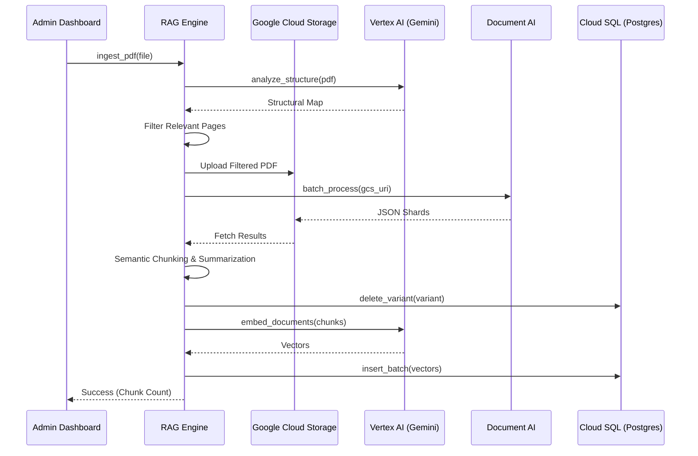
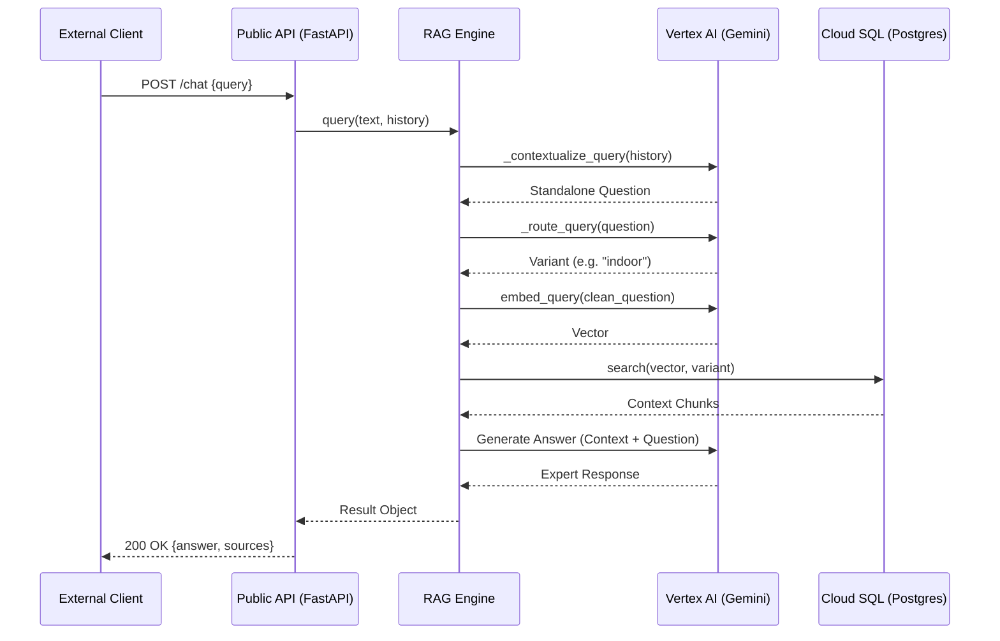

# FIH Rules Engine

A production-ready Retrieval-Augmented Generation (RAG) system providing expert-level clarity on **International Hockey Federation (FIH) Rules** for Outdoor, Indoor, and Hockey5s.

## 🚀 Overview

The FIH Rules Engine is a cloud-native headless API designed for integration into third-party applications. It transforms official PDF rulebooks into an interactive, variant-aware AI assistant.

- **Instant Clarification**: Natural language query processing via REST API.
- **Variant-Aware**: Automatic detection of Outdoor, Indoor, or Hockey5s contexts.
- **Verifiable Citations**: Reliable references to rule numbers and source pages.
- **Admin Dashboard**: Secure interface for rule ingestion and performance evaluation.

---

## 🏛️ Architecture

The system follows a **Dual-Core Architecture**, separating the public-facing API from internal administrative tools.

| Component | Technology | Role |
| :--- | :--- | :--- |
| **Public API** | **FastAPI** | Headless RAG service (REST) used by external clients. |
| **Admin Dashboard** | **Streamlit** | Internal tool for rule ingestion and metrics. |
| **Ingestion** | **Vertex AI + DocAI** | Structural parsing and AI-driven enrichment. |
| **Vector DB** | **Cloud SQL (Postgres)** | High-performance vector storage via `pgvector`. |
| **Reasoning** | **Gemini 2.0 Flash Lite** | State-of-the-art LLM for synthesis and reasoning. |

### 🛠️ The Architectural Stack

The engine is built on a "Lean-Core" principle, minimizing long-running state while leveraging Google's powerful AI infrastructure:

*   **Serverless Compute**: **Google Cloud Run** hosts both the API and Admin containers. It scales dynamically, ensuring costs only scale with usage.
*   **Vectorized Storage**: **Cloud SQL (PostgreSQL)** with `pgvector` acts as the long-term memory, storing rules as high-dimensional vectors for semantic retrieval.
*   **AI Orchestration**: **Vertex AI** powers the entire reasoning loop, from structural document analysis and embedding generation to the final context-aware answer synthesis.
*   **Infrastructure-as-a-Service**: **Document AI** and **Cloud Storage** are used as high-fidelity tools during the administrative ingestion phase to transform raw PDFs into structured knowledge.

---

## 🔄 System Flows

### Ingestion Pipeline (Sequence)
The interaction between the Admin Dashboard, Core Engine, and Google Cloud services.



### Query Flow (Sequence)
How a visitor query is processed through the headless API.



---

## 🛠️ Getting Started

### Prerequisites
- Python 3.10+
- Google Cloud CLI authenticated (`gcloud auth application-default login`)

### Installation
```bash
python3 -m venv .venv
source .venv/bin/activate
make install        # Production dependencies (Public Core only)
make dev-install    # Full dependencies (Admin + Evals + Dev)
```

### Local Development
- **Run Public API**: `make api` (Headless REST backend on port 8000)
- **Run Admin Dashboard**: `make admin` (Ingestion & Metrics on port 8501)

---

## 🧑‍💻 Operations & Maintenance

The Admin Dashboard (`make admin`) provides a specialized interface for:
- **Knowledge Ingestion**: Upload rule PDFs and map them to a variant. 
- **Automated Overwrites**: Ingesting a ruleset automatically replaces any existing data for that variant.
- **Performance Monitoring**: Visualizes RAGAS metrics and query traces.

Maintenance targets:
- `make db-clean`: Securely truncates the vector database tables.
- `make ingest-preview`: Runs a preview of the Vertex AI ingestion pipeline.
- `make evals`: Executes the RAGAS-based evaluation suite.

---

## ☁️ Deployment (Google Cloud Run)

The project is designed for serverless deployment on **Google Cloud Run**. 

Detailed, step-by-step instructions for project initialization, API activation, and final deployment (including custom Cloud Build configurations) can be found in the:

👉 **[Infrastructure Setup Guide (deployment.md)](file:///home/bavobbr/dev/fih-rules-engine/deployment.md)**

---

## 📊 Evaluation & Quality

Accuracy is verified through a synthetic evaluation pipeline:
- **RAGAS Metrics**: Faithfulness, Relevancy, Precision, and Recall.
- **LLM-as-a-Judge**: Custom scoring against curated golden datasets.
- **CI/CD Integration**: Recommended to run `make test` and `make evals` before any deployment.
